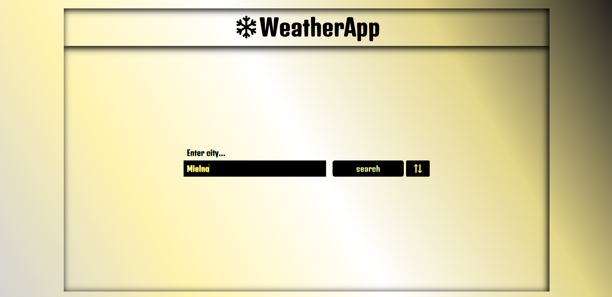

# WeatherApp



 [Click and check it!](https://maciejspalek.github.io/WeatherApp/)

## About the project 
The application displays weather in a selected city. The data is loaded from API (api.openweathermap.org) and then extracted using destructuring assignment.

## The project created with 
 * HTML
 * BEM
 * CSS + SASS
 * JS + jQuery
 * Responsive Web Design
 * Working with API


## Usage
```
npm start
```